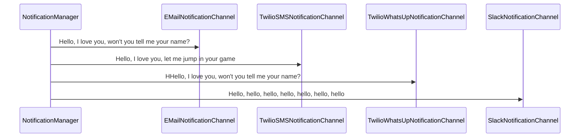

# OSSRH-77248
# Tools for Monkeys!

Tools for monkeys **T4M**. is a set of common utilities that can be used in Java projects.


# Id Generator

The IdGenerator class uses the Snowflake project to create an in-memory collection of IDs (Long Type). During the startup of this singleton, it will generate 10_000 records in-memory to be consumed, once it reaches a minimum value, it will start to generate more ids automatically.

  ``` var id = IdGenerator.getInstance().getNextId(); ```

## Notifications

The notifications channel tool, can be use to send messages by Email, Slack, TwilioSMS, TwilioWhatsUp. The NotificationManager controls the access and flush messages to pre-configured and available channels.

``` 
NotificationManager.push(  
        NotificationMessage  
           .builder()  
           .message( "Hello, I love you, won't you tell me your name?" )  
           .payload( "optional" )  
           .build()  
);
NotificationManager.flush();
``` 


## Events

Sometimes we need to audit and keep track of events. Ex, if we do receive a request and calculate the elapsed time between each of the processing tasks:

```
Request request = Request.builder()  
     .name( "Payment Process" )   
     .payload( "{}" )  
     .build();  
  
request.pushEvent( "start" );  
request.pushEvent( "processing" );  
request.pushEvent( "complete" );  

System.out.println( request.toJsonString( true ) );
```
Returning
```
{
  "id" : "803330924731310080",
  "name" : "Payment Process",
  "payload" : "{}",
  "events" : [ {
    "id" : 803330924731310081,
    "name" : "__INIT__",
    "elapsedTimeSeconds" : 0,
    "elapsedTimeNanoSeconds" : 0,
    "timestamp" : "2022-01-25T12:30:17.6956226",
    "formattedTimestamp" : "2022-01-25 12:30:17.695"
  }, {
    "id" : 803330924731310082,
    "name" : "start",
    "elapsedTimeSeconds" : 0,
    "elapsedTimeNanoSeconds" : 8811600,
    "timestamp" : "2022-01-25T12:30:17.7044342",
    "formattedTimestamp" : "2022-01-25 12:30:17.704"
  }, {
    "id" : 803330924731310083,
    "name" : "processing",
    "elapsedTimeSeconds" : 0,
    "elapsedTimeNanoSeconds" : 545000,
    "timestamp" : "2022-01-25T12:30:17.7049792",
    "formattedTimestamp" : "2022-01-25 12:30:17.704"
  }, {
    "id" : 803330924731310084,
    "name" : "complete",
    "elapsedTimeSeconds" : 0,
    "elapsedTimeNanoSeconds" : 0,
    "timestamp" : "2022-01-25T12:30:17.7049792",
    "formattedTimestamp" : "2022-01-25 12:30:17.704"
  } ],
  "checkpoints" : [ ]
}
```

## Checkpoints 

During our execution process, we can define checkpoints. 

Signup Process example:
```
Load the Json file defining our checkpoint list for this process.
---------------------------------------------------------------
CheckPointFactory.getInstance().build( new ArrayList<>(){{ 
     add("src/test/resources/checkpoint/signup.json"); 
  }});  
request.createCheckPointMapWithKey( "signup" );
---------------------------------------------------------------
(signup.json)
[  
 {  
   "id": "SGS1",  
   "module": "signup",  
   "name": "start",  
   "description": "Start of request",  
   "order": 1  
  },  
 {  
   "id": "SGV2",  
   "module": "signup",  
   "name": "validate",  
   "description": "Validate data",  
   "order": 2  
  },  
 {  
   "id": "SGP3",  
   "module": "signup",  
   "name": "persist",  
   "description": "Persist data",  
   "order": 3  
  },  
 {  
   "id": "SGC4",  
   "module": "signup",  
   "name": "completed",  
   "description": "Request is completed",  
   "order": 4  
  }  
]
```
During the execution flow we can update each of the checkpoints:

```
var checkpointMap = request.getCheckPointMap();  
checkpointMap.get("SGP3").update()
```
Containing a map with the completed checkpoints.


  
    Utilities for APIs
    Register Events and Checkpoints.
    Connectivity Inspectors to different sources like PostgreSQL, MySql, Redis, etc.
    Json Utilities - Convert Stackstrace into loggable json output
    Annotated Validators - Email, FutureDate, Number, Phone
    Notifications - Email, Slack, Twilio SMS API.
    Exceptions - Factory Pool & Reflection. - Yet Another Exception Handler. 
    Properties Management.
